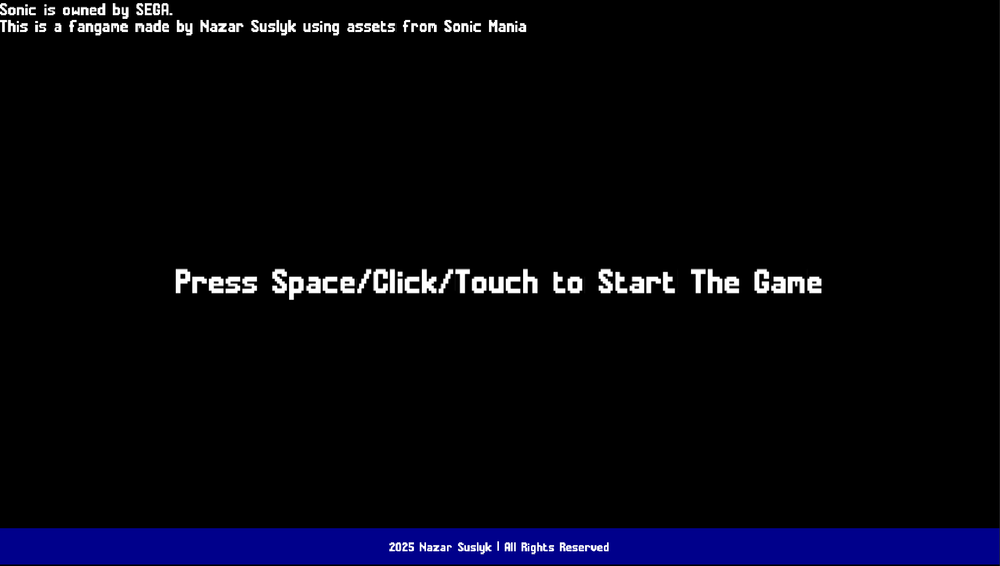
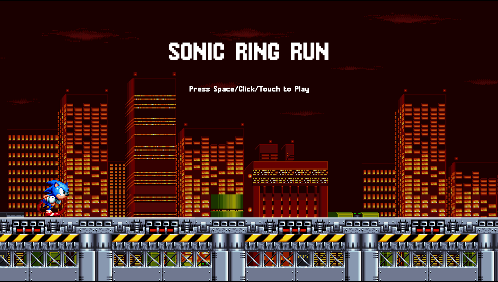
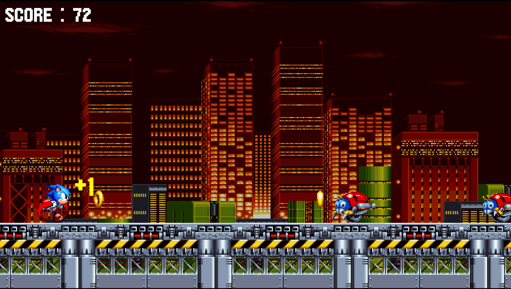

# Sonic-Runner

**Autor:** Nazar Suslyk   
**Numer albumu:** 37735  
**Wykładowca:** Mateusz Żurowski 

---

## 🎮 Opis projektu

**Sonic-Runner** to dynamiczna gra platformowa typu „runner” stworzona jako projekt edukacyjny, oparty na lekkim silniku JavaScript o nazwie **Kaplay**.  
Gracz wciela się w postać Sonica i przemieszcza się w prawo, unikając przeciwników oraz zbierając pierścienie.

---

## 🔥 Funkcje gry

- Sterowanie: klawisz **spacji**, **myszka**, **dotyk**  
- Sceny gry: **Disclaimer** → **Main Menu** → **Gameplay** → **Game Over**  
- Przeciwnicy i kolizje (Motobugi)  
- Zbieranie pierścieni  
- Efekty dźwiękowe i animacje  
- Obsługa ekranów dotykowych i PC  
- Przechowywanie najlepszego wyniku  

---

## 📸 Zrzuty ekranu

### 1️⃣ Disclaimer  


### 2️⃣ Menu Główne  


### 3️⃣ Rozgrywka  


### 4️⃣ Ekran Game Over  


---

## 📂 Struktura folderów

```

sonic-runner/
├── public/
│ ├── graphics/
│ │ ├── chemical-bg.png
│ │ ├── platforms.png
│ │ ├── sonic.png
│ │ ├── ring.png
│ │ └── motobug.png
│ ├── fonts/
│ │ └── mania.ttf
│ ├── sounds/
│ │ ├── Destroy.wav
│ │ ├── Hurt.wav
│ │ ├── HyperRing.wav
│ │ ├── Jump.wav
│ │ ├── Ring.wav
│ │ └── city.mp3
│ ├── disclaimer.png
│ ├── mainmenu.png
│ ├── gameplay.png
│ └── gameover.png
├── src/
│ ├── entities/
│ │ ├── motobug.js
│ │ ├── ring.js
│ │ └── sonic.js
│ ├── scenes/
│ │ ├── disclaimer.js
│ │ ├── game.js
│ │ ├── gameover.js
│ │ └── mainMenu.js
│ ├── kaplayCtx.js
│ └── main.js
├── index.html
├── vite.config.js
├── package.json
└── README.md

````

---

### 📝 Scena Disclaimer (intro gry)

Pierwsza scena, którą widzi gracz – zawiera informację o prawach do postaci i przycisk startu.

```js
import k from "../kaplayCtx";

export default function disclaimer() {
  k.add([
    k.text(
      `Sonic is owned by SEGA.\nThis is a fangame made by Nazar Suslyk using assets from Sonic Mania`,
      { font: "mania", size: 32 }
    ),
  ]);

  k.add([
    k.text("Press Space/Click/Touch to Start The Game", {
      font: "mania",
      size: 64,
    }),
    k.anchor("center"),
    k.pos(k.center().x, k.center().y),
  ]);

  k.onButtonPress("jump", () => k.go("main-menu"));

  k.add([k.rect(k.width(), 70), k.pos(0, k.height() - 70), k.color(0, 0, 139)]);

  k.add([
    k.text("2025 Nazar Suslyk | All Rights Reserved", {
      font: "mania",
      size: 24,
      color: { r: 255, g: 255, b: 255 },
    }),
    k.anchor("center"),
    k.pos(k.center().x, k.height() - 32.5),
  ]);
}
````

➡️ Po naciśnięciu spacji lub kliknięciu następuje przejście do menu głównego (`main-menu`).

---

### 🎛️ Scena Main Menu

Menu startowe z tytułem gry oraz zachętą do rozpoczęcia.

```js
export default function mainMenu() {
  k.add([
    k.text("SONIC RING RUN", { font: "mania", size: 96 }),
    k.anchor("center"),
    k.pos(k.center().x, 200),
  ]);

  k.add([
    k.text("Press Space/Click/Touch to Play", { font: "mania", size: 32 }),
    k.anchor("center"),
    k.pos(k.center().x, k.center().y - 200),
  ]);

  makeSonic(k.vec2(200, 745)); // Prezentacja Sonica

  k.onButtonPress("jump", () => k.go("game")); // Rozpocznij grę
}
```

➡️ W tej scenie można zobaczyć Sonica oraz animowane tło i platformy. Po naciśnięciu klawisza lub kliknięciu – rozpoczyna się gra.

---

### 🏃‍♂️ Scena Game (rozgrywka)

To tutaj dzieje się cała akcja – ruch, przeciwnicy, zbieranie pierścieni.

```js
export default function game() {
  const sonic = makeSonic(k.vec2(200, 745));
  
  // Dodawanie pierścieni i przeciwników
  spawnRing();
  spawnMotobug();

  // Detekcja kolizji
  sonic.onCollide("ring", (r) => {
    k.destroy(r);
    k.play("ring");
    score++;
  });

  sonic.onCollide("enemy", () => {
    k.go("gameover", { score });
  });
}
```

---

### 🦔 Funkcja `makeSonic()`

Funkcja pomocnicza do tworzenia bohatera (Sonica) – dodaje animacje, fizykę i właściwości kolizji.

```js
export function makeSonic(pos) {
  return k.add([
    k.sprite("sonic", { anim: "run" }),
    k.pos(pos),
    k.area(),
    k.body(),
    k.scale(4),
    k.anchor("center"),
    "sonic",
  ]);
}
```

➡️ Sonic automatycznie biega i podskakuje po naciśnięciu spacji.

---

### 💥 Scena Game Over

Po zderzeniu z przeciwnikiem gra się kończy, a gracz widzi wynik i opcję ponownej gry.

```js
export default function gameover({ score }) {
  k.add([
    k.text(`Game Over\nScore: ${score}`, { font: "mania", size: 48 }),
    k.anchor("center"),
    k.pos(k.center()),
  ]);

  k.onClick(() => k.go("main-menu"));
}
```

➡️ Kliknięcie powraca do menu głównego, gdzie można rozpocząć nową rundę.

---

## ▶️ Jak uruchomić projekt lokalnie

1. **Sklonuj repozytorium**

```bash
git clone https://github.com/Nazar570/sinnic-runner-final-839.git
cd sonic-runner-master
```

2. **Zainstaluj zależności**

```bash
npm install
```

3. **Uruchom serwer developerski**

```bash
npm run dev
```

---

## 🛠️ Wykorzystane zasoby

* 🎮 **Silnik:** [Kaplay.js](https://kaplayjs.com/)
* 🎵 **Dźwięki:** klasyczne sample z gier Sonic
* 🖼️ **Grafiki:** sprite’y i tła w stylu Sonic Mania
* 🔠 **Font:** mania.ttf
